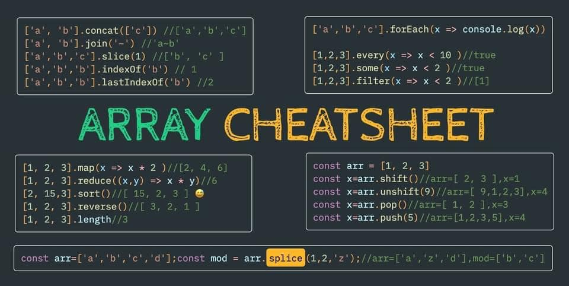
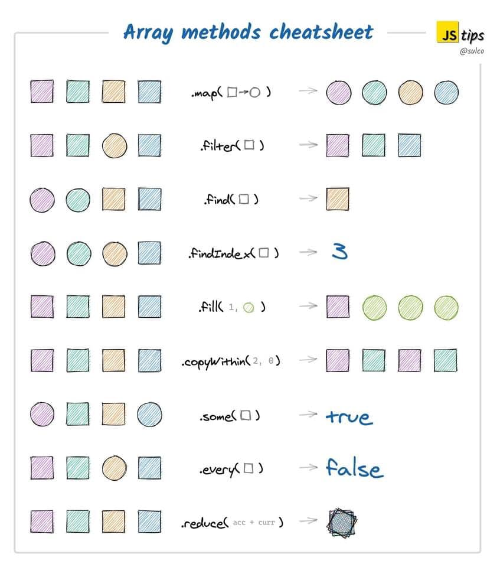
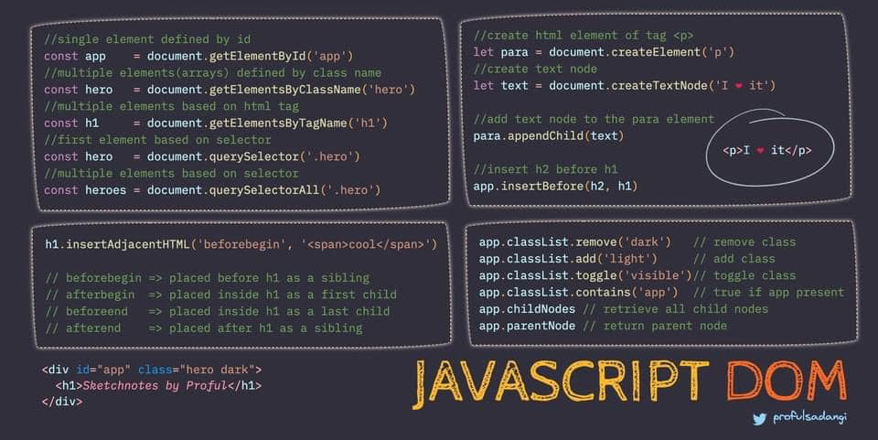
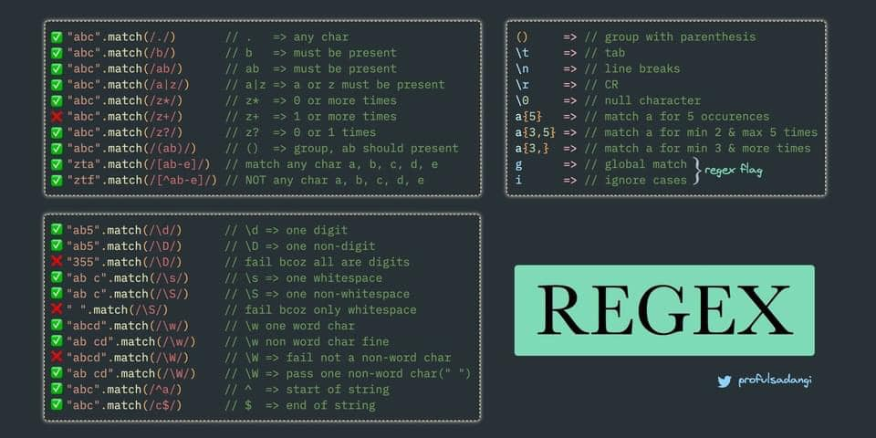
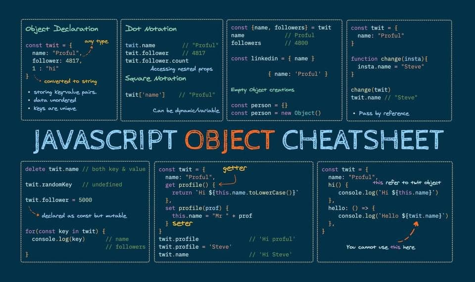

# Books and CheatSheets related to code
### Welcome:
#### Here you will find some of my interesting foundings on the net related to coding:

##### Arrays

##### DOM 

##### REGEX

##### REGEX

  

## Contacte me: 

